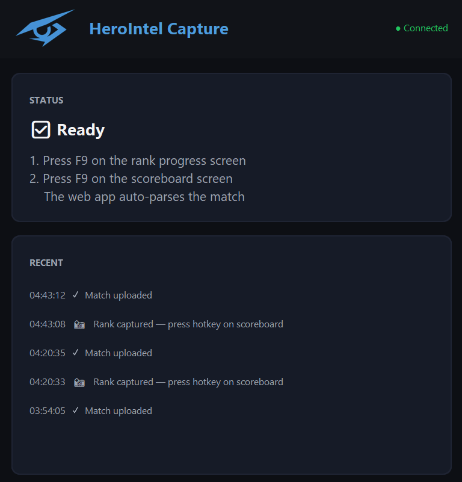

# HeroIntel Capture

<p align="center">
  
</p>

A lightweight Windows tray app for [HeroIntel](https://herointel.gg) — Overwatch stat-tracking website. Press F9 twice per match (once on rank progress, once on the scoreboard) and your match is uploaded and parsed automatically.

## What it does

- Sits in your system tray
- Captures your screen on hotkey (default: **F9**)
- Two-phase flow: rank progress → scoreboard, then bundles them into a pending match
- Web app picks up the pending match and runs the existing OCR + parsing pipeline
- One-time pairing via the web app — no passwords stored locally

## Trust & Anticheat

Overwatch uses Blizzard's Warden anticheat. This app is engineered to be invisible to it:

- **Capture uses [`mss`](https://github.com/BoboTiG/python-mss) (GDI BitBlt)** — the same Windows primitive that OBS, Discord, and the Snipping Tool use. Pure user-space.
- **No kernel driver. No process injection. No DLL hooks.**
- **Never attaches to or reads from the Overwatch process.**
- **Hotkeys via Win32 `RegisterHotKey`** — same API as the Steam overlay.
- **Authentication via Firebase REST** — runs in your user-space process, no privileged access required.

The code is here in this repo. If you don't trust the prebuilt binary, build it yourself in five minutes (instructions below) — it's a single Python script.

## Getting started

1. Download `HeroIntelCapture.exe` from the [Releases](../../releases) page
2. Run it — Windows SmartScreen may warn you about an unsigned binary; click "More info" → "Run anyway"
3. The pairing dialog opens with an 8-character code (e.g. `ABCD-1234`)
4. Click "Open pairing page" — your browser opens [herointel.gg/pair](https://herointel.gg/pair)
5. Sign in with Google if you aren't already, type the code, click Pair
6. The dialog flips to "Paired ✓" and the app is now in your system tray

## Per-match flow

1. Finish a match. The rank-progression screen appears.
2. Press **F9**. A toast confirms "Rank captured."
3. Tab to the scoreboard view. Press **F9** again. Toast: "Match captured."
4. Open the web app — a "Screenshot captured" notification links to the auto-parsed match.

If you mis-time the first F9, right-click the tray icon → "Cancel pending."

## Build from source

Requirements: Python 3.10+, pip, Windows 10/11.

```cmd
pip install -r requirements.txt
copy _constants_example.py _constants.py
python main.py
```

To produce a redistributable `.exe`:

```cmd
pyinstaller --noconfirm HeroIntelCapture.spec
```

The output lands in `dist/HeroIntelCapture.exe` (~30 MB, single-file).

## Configuration

`_constants.py` holds four values — three are public Firebase keys (intentionally so; the security perimeter is Firestore rules, not API key secrecy) and one is the web app URL:

```python
FIREBASE_API_KEY        # NEXT_PUBLIC_FIREBASE_API_KEY from the web app
FIREBASE_PROJECT_ID     # NEXT_PUBLIC_FIREBASE_PROJECT_ID
FIREBASE_STORAGE_BUCKET # NEXT_PUBLIC_FIREBASE_STORAGE_BUCKET
WEB_APP_URL             # https://herointel.gg
```

To point the desktop app at a different deployment (e.g. a self-hosted fork of HeroIntel), edit `_constants.py` before running.

## Where data lives

- **Refresh token**: encrypted in Windows Credential Manager (via [`keyring`](https://pypi.org/project/keyring/))
- **Config** (hotkey, paired UID): `%APPDATA%\HeroIntelCapture\config.json`
- **Screenshots**: uploaded to your account's Firebase Storage; the desktop app holds them in memory only long enough to compress the JPEG

## Hotkey configuration

Default is `f9`. Change it via the Settings dialog inside the app. Optional secondary "cancel" hotkey lets you abort a pending capture (useful if you mis-time the first press).

Format follows the [`keyboard`](https://github.com/boppreh/keyboard) library's convention: `f9`, `ctrl+shift+s`, `alt+f1`, etc.

## License

MIT — see [LICENSE](LICENSE).
